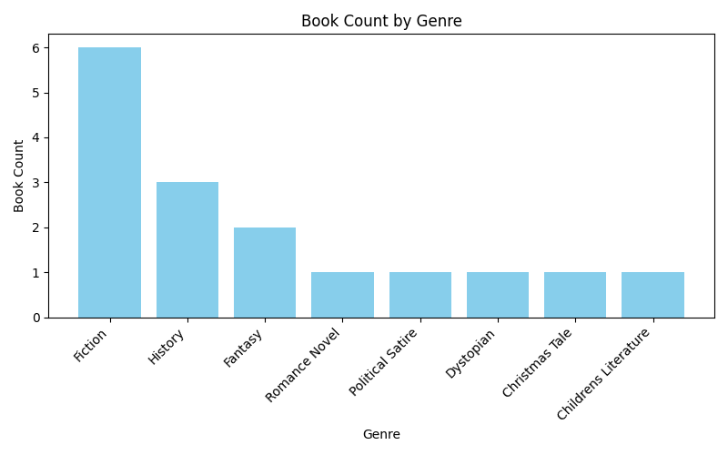

# 📚 datafun-05-sql
**Summer 1 - Module 5 SQL Project**

---

## 1. Virtual Environment Management (Windows PowerShell)

**Set up your Python environment for reliable, repeatable results:**

1. **Create a virtual environment**
   ```powershell
   py -m venv .venv
   ```

2. **Activate the virtual environment**
   ```powershell
   .\.venv\Scripts\activate
   ```

3. **Upgrade pip, setuptools, and wheel**
   ```powershell
   py -m pip install --upgrade pip setuptools wheel
   ```

4. **Install required packages**
   ```powershell
   py -m pip install --upgrade -r requirements.txt
   ```

---

## 2. Running Python Scripts

- **Activate your `.venv` and ensure all required packages are installed.**
- **Verify all external packages in your scripts are listed in `requirements.txt`.**

**Run Python scripts:**
```powershell
py demo_script.py
py do_stats.py
py draw_chart.py
py greet_user.py
py db01_setup.py
py db02_features.py
py db03_queries.py
```

---

## 3. Repeatable Workflow Checklist

When resuming work on your project, follow these steps:

1. Pull latest changes from your repository
2. Activate your virtual environment
3. Install dependencies (`requirements.txt`)
4. Run Python scripts as needed
5. Modify and test your code
6. Add, commit, and push changes to Git

---

## 4. Git Add-Commit-Push Cheat Sheet

```powershell
git clone https://github.com/youraccount/yourrepo
git add .
git commit -m "custom message"
git push -u origin main
git pull origin main
git push
```

---

## 5. Project Structure & Workflow

### **Step 1: Start Project, Open in VS Code**

- Create a `data` folder for CSV files
- Add example scripts and SQL folders

### **Step 2: Add/Update Critical Files**

- `.gitignore` — tells Git which files/folders to ignore
- `requirements.txt` — lists all Python packages used

```powershell
git add .
git commit -m "Add .gitignore and requirements.txt"
git push -u origin main
```

### **Step 3: Set up Virtual Environment**

- Create `.venv`
- Activate `.venv`
- Install dependencies into `.venv`
- Select VS Code interpreter to use `.venv`

---

## 6. Database Schema Design

**Authors Table**
| Column      | Type     | Description                                  |
|-------------|----------|----------------------------------------------|
| author_id   | TEXT PK  | Prefixed sequential ID (e.g., AUTHOR_001)    |
| name        | TEXT     | Author's name (required)                     |
| birth_year  | INTEGER  | Year of birth (optional)                     |
| nationality | TEXT     | Nationality (optional)                       |

**Books Table**
| Column                  | Type     | Description                                      |
|-------------------------|----------|--------------------------------------------------|
| book_id                 | TEXT PK  | Prefixed sequential ID (e.g., BOOK_001)          |
| title                   | TEXT     | Book title (required)                            |
| genre                   | TEXT     | Book genre (optional)                            |
| publication_year        | INTEGER  | Year of publication (optional)                   |
| author_id               | TEXT FK  | Foreign key linking to authors                   |
| author_age_at_publication | INT    | Age of author at publication (calculated field)  |

---

## 7. SQL Scripts & Python Integration

### **SQL Scripts Organization**

- **sql_create/**
  - `01_drop_tables.sql` — Drop tables to restart
  - `02_create_tables.sql` — Create your database schema
  - `03_insert_records.sql` — Insert at least 10 records into each table

- **sql_features/**
  - `update_records.sql` — Update book titles
  - `delete_records.sql` — Delete specific records
  - `01_new_column_pub_age.sql` — Add column for author age at publication

- **sql_queries/**
  - `01_count_books_by_author.sql` — Count books by each author
  - `02_filter_by_genre.sql` — Filter books by genre
  - `03_order_by_age.sql` — Sort by author age
  - `04_group_nationality.sql` — Count books by nationality
  - `05_join_born_before_1900.sql` — Count authors born before 1900

### **Python Scripts**

- **db01_setup.py** — Create database, define schema, insert records (easy to re-run)
- **db02_features.py** — Run SQL scripts to update, delete, and add columns
- **db03_queries.py** — Run SQL queries, summarize, and visualize results

---

## 8. Data Analysis & Visualization

- Use SQL for data cleaning, feature engineering, and aggregation.
- Use Python (`pandas`, `matplotlib`) to execute SQL, summarize, and visualize results.
- Example: `db03_queries.py` will chart, illustrate, and summarize each SQL query in the `sql_queries` folder.
  
Results for 01_count_books_by_author.sql:
            author_name  book_count
0          J.K. Rowling           2
1         George Orwell           2
2      David McCullough           2
3        Mark Kurlansky           1
4           Jane Austen           1
5           James Joyce           1
6         J.R.R Tolkien           1
7        J. D. Salinger           1
8       Herman Melville           1
9            Harper Lee           1
10  F. Scott Fitzgerald           1
11            Dr. Seuss           1
12      Charles Dickens           1

Results for 02_filter_by_genre.sql:
                  genre  book_count
0               Fiction           6
1               History           3
2               Fantasy           2
3         Romance Novel           1
4      Political Satire           1
5             Dystopian           1
6        Christmas Tale           1
7  Childrens Literature           1

Results for 03_order_by_age.sql:
            author_name  birth_year
0          J.K. Rowling        1965
1        Mark Kurlansky        1948
2      David McCullough        1933
3            Harper Lee        1926
4        J. D. Salinger        1919
5             Dr. Seuss        1904
6         George Orwell        1903
7   F. Scott Fitzgerald        1896
8         J.R.R Tolkien        1892
9           James Joyce        1882
10      Herman Melville        1819
11      Charles Dickens        1812
12          Jane Austen        1775

Results for 04_group_nationality.sql:
  nationality  book_count
0    American           8
1     British           4
2     English           3
3       Irish           1

Results for 05_join_born_before_1900.sql:
   book_count  author_count
0           6             6





---

## 🚀 Tips

- Keep your workflow repeatable and your environment isolated.
- Use version control for all scripts and SQL files.
- Document your process and findings in this README.

---
